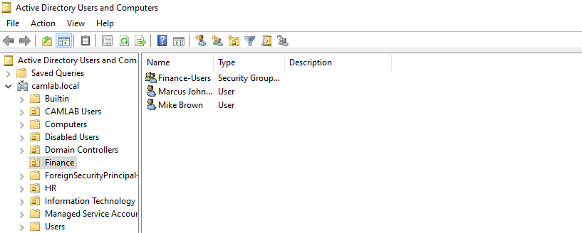
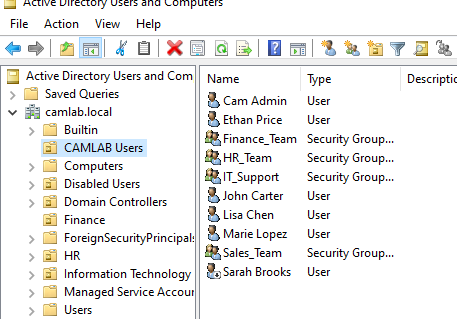
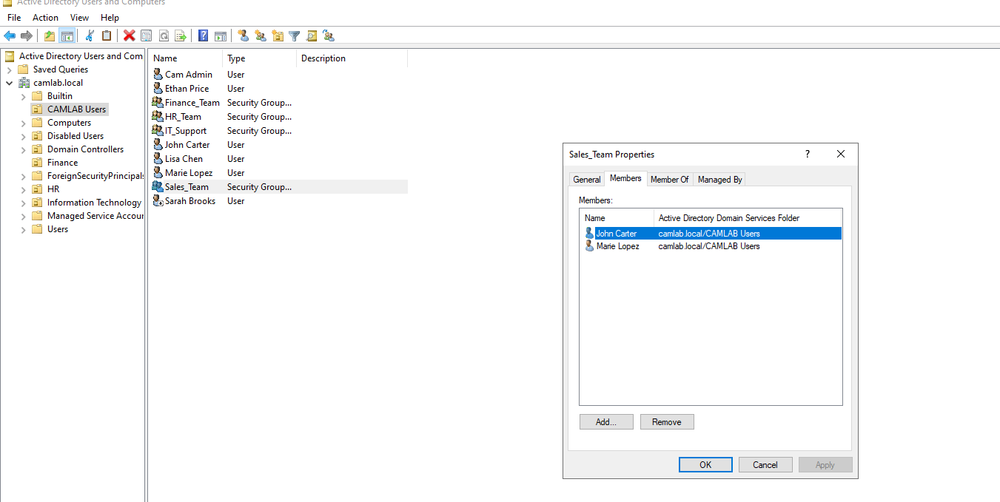
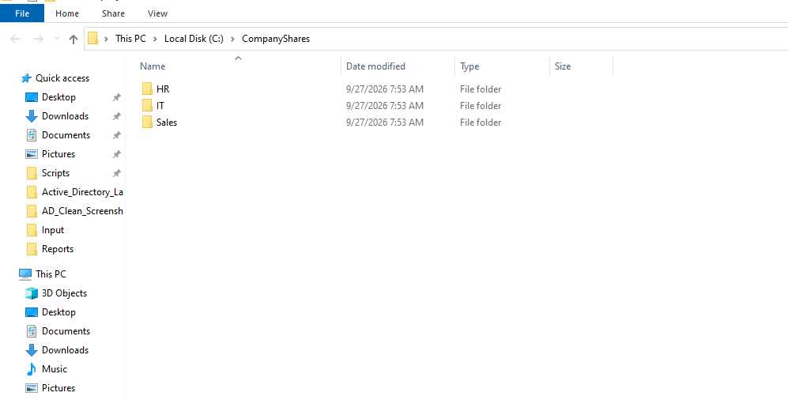
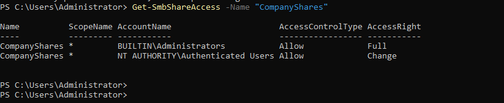
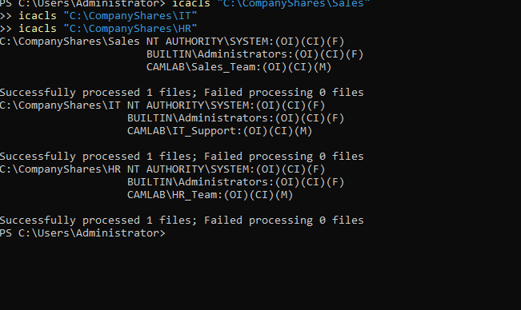

# Active Directory RBAC & NTFS Access Control

An Active Directory access-management lab that maps department roles to security groups and NTFS permissions. The environment demonstrates how an IAM or IT administrator can grant access through group membership instead of assigning permissions directly to individual users.

## Business problem and risk

Organizations need a repeatable way to give employees access to departmental resources. Directly assigning permissions to individuals creates inconsistent access, makes role changes difficult, and increases the chance that users retain access they no longer need.

This lab uses organizational units, role-based security groups, and group-assigned NTFS permissions to enforce least privilege and make access easier to review and revoke.

| Risk | Control demonstrated |
|---|---|
| Users receive access outside their job function | Department-based security groups |
| Permissions are assigned inconsistently | Group-based NTFS authorization |
| Access is difficult to review | Centralized group membership |
| Role changes leave unnecessary access behind | Membership can be removed from the previous role |
| Administrative and standard identities are mixed | Separate user, department, and privileged structures |

## Solution implemented

I built a Windows Server Active Directory environment with department-based users, organizational units, and security groups. I created HR, IT, and Sales folders in a centralized company share and assigned NTFS permissions to the matching groups.

Users receive access through approved security-group membership rather than direct user permissions. This reflects a scalable RBAC pattern used in enterprise Active Directory environments.

## Environment

- Windows Server 2022 domain controller
- Active Directory Domain Services
- Active Directory Users and Computers
- PowerShell
- SMB file sharing
- NTFS permissions
- Department-based security groups

## Access workflow

1. Create the department organizational structure in Active Directory.
2. Provision test identities using separate standard and privileged accounts.
3. Create `HR_Team`, `IT_Support`, and `Sales_Team` security groups.
4. Add each user to the group matching the approved business role.
5. Create HR, IT, and Sales folders within `C:\CompanyShares`.
6. Publish `CompanyShares` as an SMB share.
7. Assign NTFS permissions to security groups instead of individual users.
8. Review group membership, share access, and folder permissions.

## Validation evidence

### Active Directory identities and groups

The Finance organizational unit contains its assigned users and security group.

Finance group membership was reviewed to confirm that access is managed centrally.

The central user organizational unit contains the test identities and department security groups used in the access model.

Sales group membership confirms that John Carter and Marie Lopez receive Sales access through `Sales_Team`.

### File-share structure and permissions

The company share contains separate HR, IT, and Sales department folders.

SMB share access grants Administrators Full access and Authenticated Users Change access.

NTFS permissions grant Modify access to the matching department groups while Administrators and SYSTEM retain Full control.

## Result

The completed environment uses role-based group membership to control access to departmental resources. The design reduces direct permission assignments, supports least privilege, and gives administrators one place to review or remove access when a user changes roles.

## Skills demonstrated

- Active Directory administration
- RBAC and group-based authorization
- User and security-group management
- Organizational-unit design
- SMB share administration
- NTFS permissions
- Least-privilege access
- Access review and troubleshooting
- PowerShell validation

## Production improvements

In a production environment, I would add:

- Separate share and NTFS permission layers using an AGDLP-style group model
- A documented access-request and manager-approval workflow
- Explicit authorized and unauthorized user testing
- Periodic access reviews for department groups
- PowerShell reporting for group membership and permission drift
- Ticket IDs and change records for every access modification
