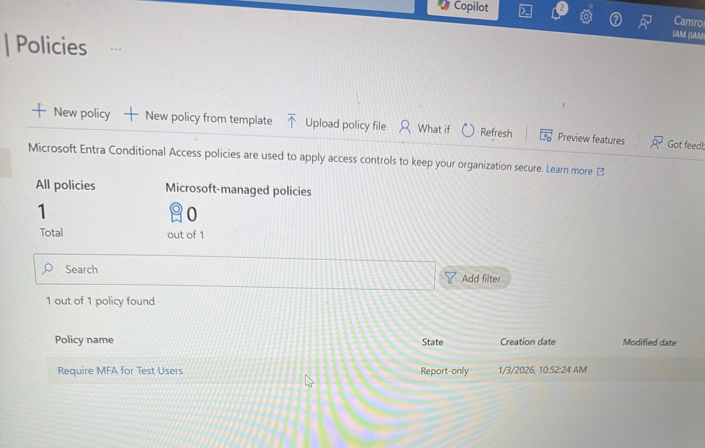
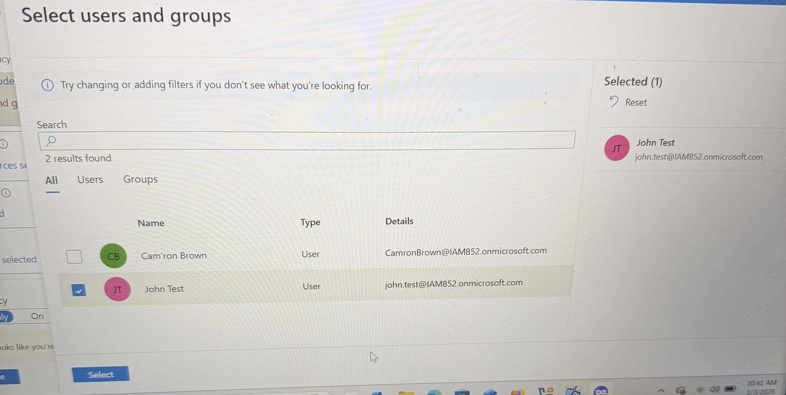
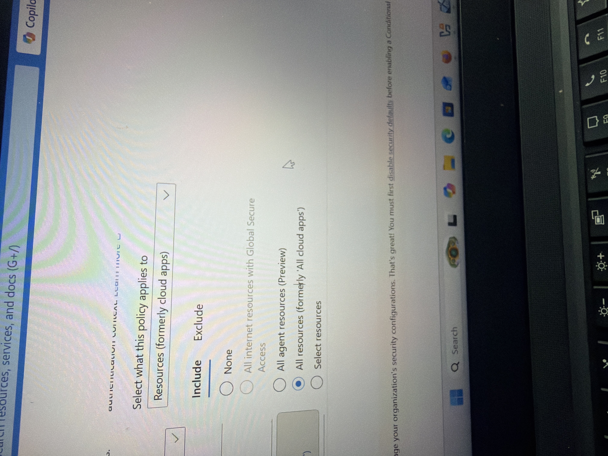
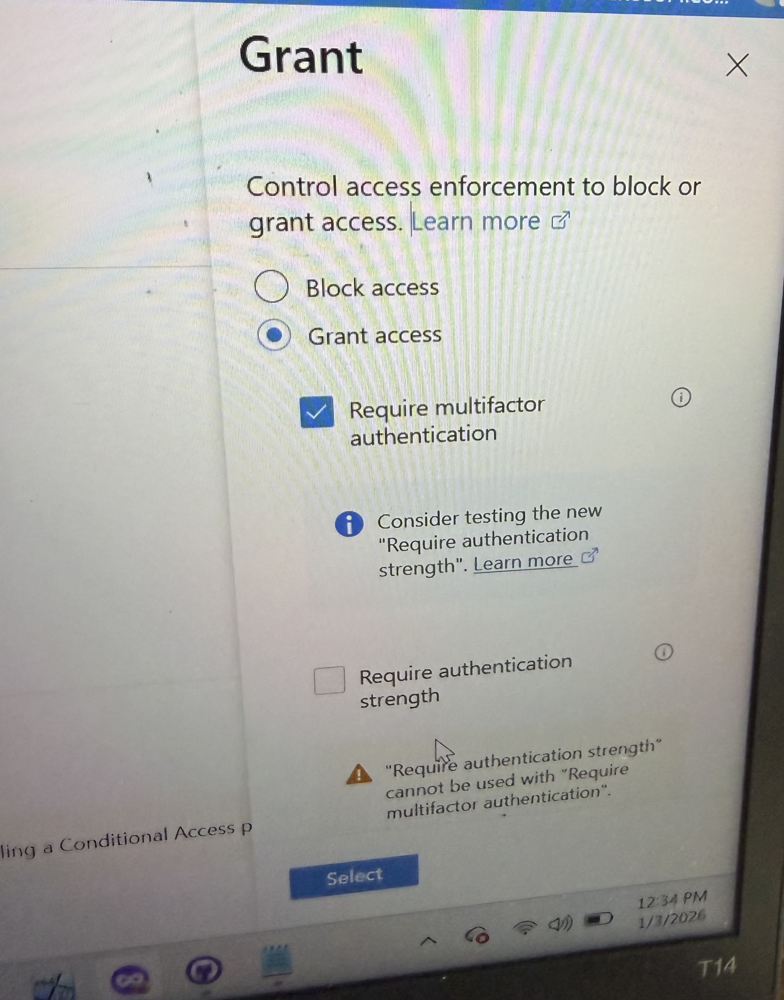
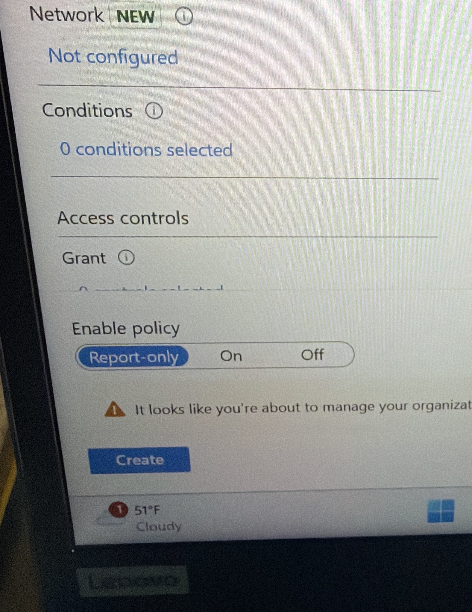
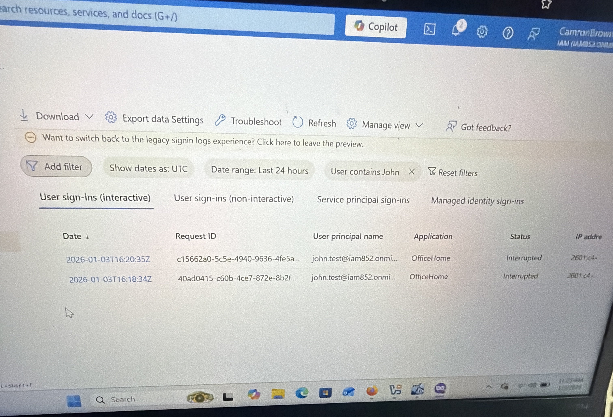
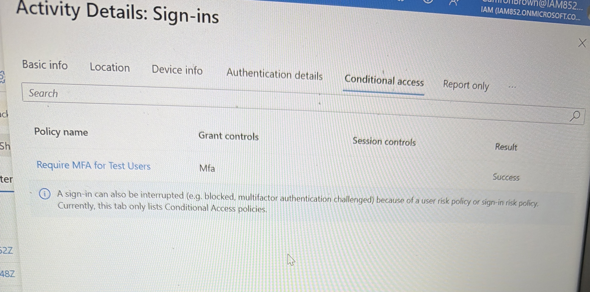

# Microsoft Entra Conditional Access & MFA

A Microsoft Entra ID security lab that uses Conditional Access to require multifactor authentication and validates enforcement through sign-in logs.

## Business problem and risk

Password-only authentication leaves cloud accounts vulnerable to phishing, credential reuse, and password-spraying attacks. If a password is compromised, an attacker may access organizational applications without another verification factor.

This lab applies an identity-based Conditional Access policy that requires MFA for a controlled test user and verifies the result using Entra sign-in evidence.

| Risk | Control demonstrated |
|---|---|
| Compromised password grants direct access | Require MFA through Conditional Access |
| Policy affects unintended users | Scope the policy to a test identity before wider deployment |
| Cloud applications remain outside protection | Target the required cloud resources |
| Administrators cannot prove enforcement | Review sign-in logs and policy evaluation details |
| Misconfiguration causes lockout | Test in a limited scope before production rollout |

## Solution implemented

I created a Conditional Access policy in Microsoft Entra ID, assigned it to a test user, targeted cloud applications, and configured the grant control to require MFA. I then performed a test sign-in and reviewed the sign-in logs to confirm that the policy interrupted password-only access and required additional authentication.

## Environment

- Microsoft Entra ID
- Microsoft Entra admin center
- Conditional Access
- Multifactor authentication
- Test user: `John Test`
- Microsoft 365 cloud application
- Entra sign-in logs

## Workflow

1. Create a Conditional Access policy for MFA enforcement.
2. Scope the policy to the test user.
3. Select the target cloud resources.
4. Configure the grant control to require MFA.
5. Enable the policy in the test scope.
6. Attempt authentication as the test user.
7. Review sign-in logs and Conditional Access evaluation details.

## Validation evidence

### Policy configuration

### Enforcement result

The test sign-in was interrupted because the Conditional Access policy required MFA. The evaluation details identify the policy responsible for the authentication decision.

## Result

The policy successfully required MFA for the scoped identity. Sign-in evidence confirmed that password-only authentication was insufficient for the protected resource and that the intended Conditional Access policy was applied.

## Skills demonstrated

- Microsoft Entra ID administration
- Conditional Access policy configuration
- MFA enforcement
- Authentication-log analysis
- Policy scoping and validation
- Identity-security troubleshooting

## Production improvements

In a production environment, I would add:

- Report-only deployment and impact analysis before enforcement
- Break-glass account exclusions and emergency-access monitoring
- Named locations, device state, and sign-in-risk conditions
- Authentication-strength requirements instead of basic MFA alone
- Exclusions for service accounts and workload identities where appropriate
- Change approval, rollback planning, and documented test cases
- Ongoing sign-in monitoring and periodic policy review
