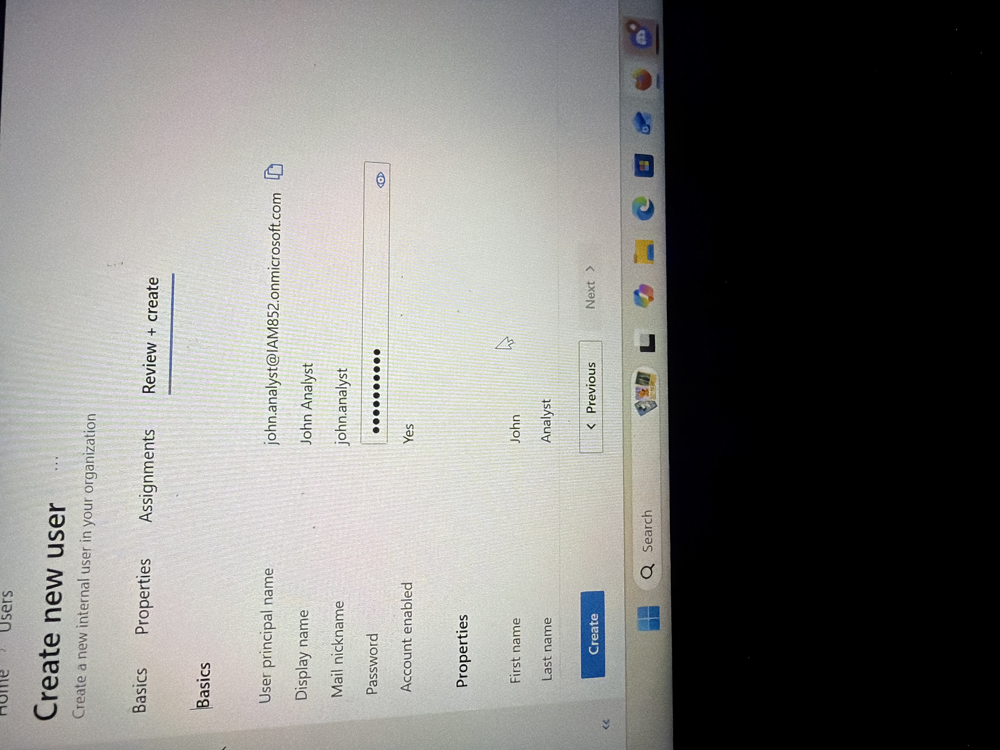
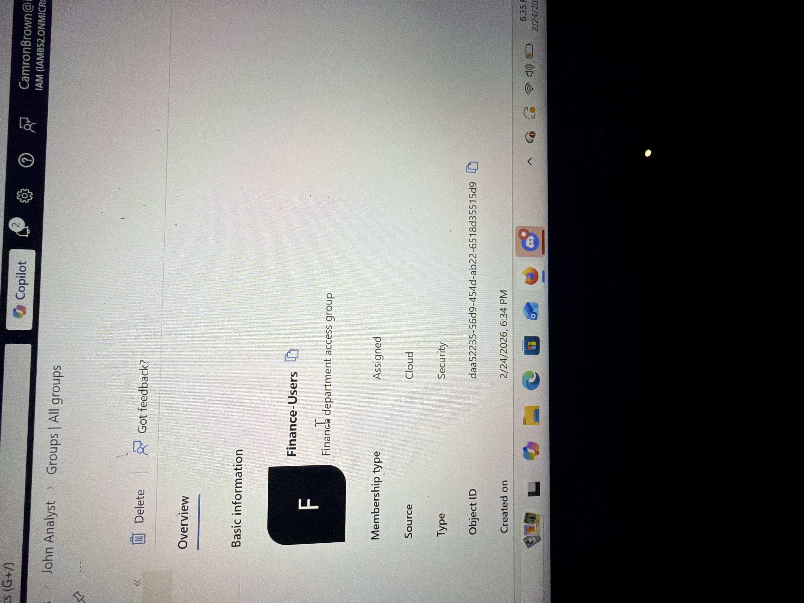
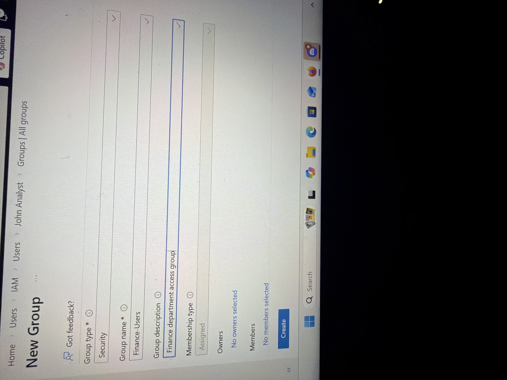
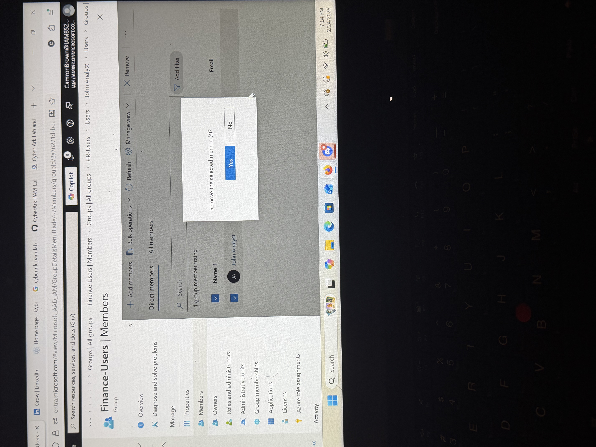
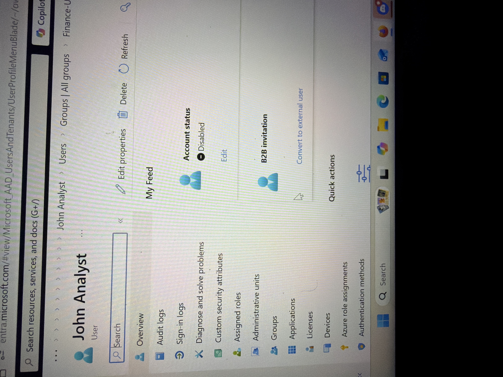

# Microsoft Entra ID Joiner-Mover-Leaver Lifecycle

A Microsoft Entra ID lab that demonstrates the Joiner-Mover-Leaver (JML) identity lifecycle: creating an employee identity, changing access after a department transfer, and terminating access when the employee leaves.

## Business problem and risk

Employee access must stay aligned with employment status and job responsibilities. Delayed onboarding affects productivity, role changes can create excessive access, and incomplete offboarding can leave former employees with active accounts.

This lab applies a structured JML process using user attributes, security groups, least privilege, and account disablement.

| Lifecycle event | Primary risk | Control demonstrated |
|---|---|---|
| Joiner | New employee lacks required access or receives excessive access | Role-aligned attributes and group membership |
| Mover | Employee retains access from the previous department | Remove old group membership before assigning the new role |
| Leaver | Former employee retains an active identity | Disable the account and revoke group-based access |

## Solution implemented

I created a test employee in Microsoft Entra ID and processed the identity through three business events:

- **Joiner:** created and enabled a Finance employee and assigned Finance access.
- **Mover:** transferred the employee to HR, removed Finance access, and assigned HR access.
- **Leaver:** disabled the account and removed active access while retaining the identity object for audit evidence.

## Environment

- Microsoft Entra ID
- Entra admin center
- Test employee identity
- `Finance-Users` and `HR-Users` security groups
- User attributes for department and job title

## Workflow

### Joiner

1. Create the employee identity.
2. Set the department to Finance and job title to Financial Analyst.
3. Enable the account.
4. Create or validate the `Finance-Users` group.
5. Add the employee to the approved Finance group.

### Mover

1. Update the department and job title to the new HR role.
2. Remove the employee from `Finance-Users`.
3. Create or validate the `HR-Users` group.
4. Add the employee to `HR-Users`.
5. Review membership to confirm old access is no longer present.

### Leaver

1. Disable the employee account.
2. Remove group-based access.
3. Retain the disabled identity temporarily for audit and recovery requirements.

## Validation evidence

### Joiner — identity creation and Finance access

### Mover — Finance-to-HR transfer

### Leaver — account disabled

## Result

The employee identity remained aligned with each business event. Finance access was assigned during onboarding, removed during the transfer to HR, and the account was disabled during offboarding. The workflow demonstrates the relationship between HR-driven lifecycle events and identity-access changes.

## Skills demonstrated

- Joiner-Mover-Leaver lifecycle administration
- Microsoft Entra ID user management
- Group-based RBAC
- Provisioning and deprovisioning
- Least-privilege enforcement
- Access reassignment and revocation
- Audit-oriented identity retention

## Production improvements

In a production environment, I would add:

- HRIS-driven lifecycle triggers and automated provisioning
- Manager and application-owner approvals
- Time-bound access and entitlement policies
- License assignment and removal
- Session and refresh-token revocation during offboarding
- Audit logs, ticket IDs, and completion timestamps
- Access reviews to detect retained or excessive permissions
