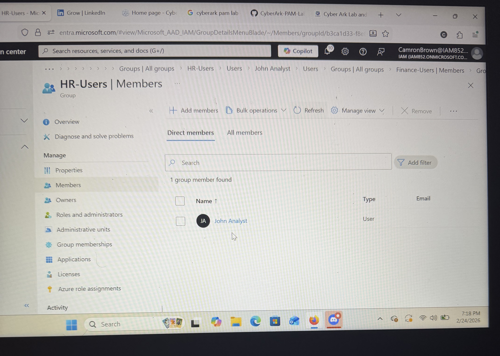

# Identity Lifecycle Management (JML) Lab 

## Lab Objective

This lab simulates enterprise Identity Lifecycle Management (Joiner-Mover-Leaver) workflow using Microsoft Entra ID.
The objective is to demostrate structured identity provisioning, role-based access control (RBAC), access reassignment , and secure offboarding procedures.

---

# Joiner - Identity Provisioning 

### Scenerio
A new employee is onboard into the Finance department as a Financial Analyst.

### Actions Performed 
- Created user in Microsoft Entra ID 
- Assigned Department: Finance
- Assigned Job Title: Financial Analyst 
- Enabled user account
- Created Finance-Users security group
- Added user to Finance-Users group

### Evidence

### Security Controls Demonstrated
- Structured identity provisioning
- Group-based RBAC
- Access alignment with job function 

---

# Mover - Department Transfer

### Scenario 
The employee trnasfers from Finance to HR.

### Actions Performed 
- Updated Department to Hr
- Updated Job Title to HR Analyst
- Removed user from Finance-Users group
- Added user to HR-Users group

### Evidence

### Security Controls Demonstrated
- Enforcement of least privilege 
- Access revocation from previous role
- Role-based access reassignment

---

#Leaver - Secure Offboarding 

### Scenario
The employee leaves the organization.

### Actions Performed
- Disabled user account
- Revoked access though group removal 
- Preserved identity object for audit purposes

### Evidence

### Security Controls Demonstrated
- Immediate access termination 
- Insider threat mitigation
- Identity lifecycle governance

---

#IAM Concepts Demonstrated 

- Identity Lifecycle Management (JML)
- Role-Based Access Control (RBAC)
- Least Privilege Enforcement
- Group-Based Access Management 
- Microsoft Entra ID Administration
