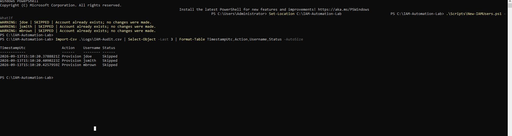
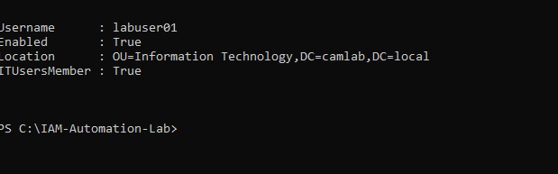
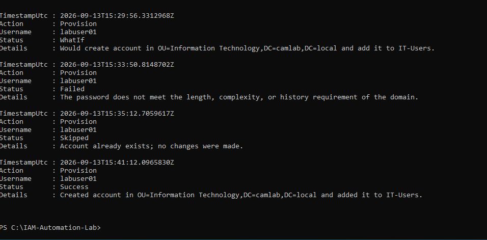
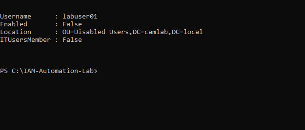
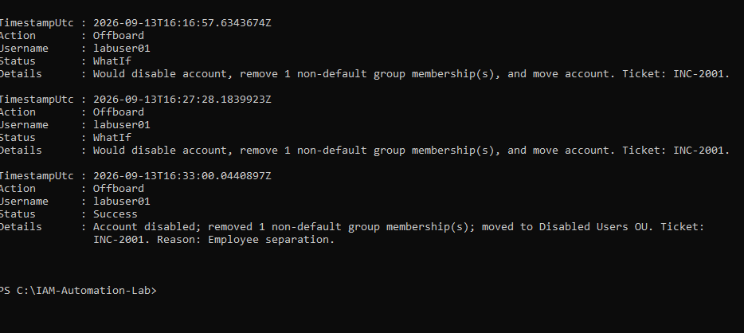

# Active Directory Identity Lifecycle Automation

PowerShell automation for two common IAM operations: onboarding employees and removing access during offboarding. The lab uses CSV requests, validates Active Directory dependencies before making changes, applies least-privilege cleanup, and writes a structured audit trail.

> **Demo video:** Coming after validation in the Windows Server lab.

## Business problem and risk

Manual account administration is slow and inconsistent. A missed group assignment can delay a new hire, while an account or group membership left active after separation creates unauthorized-access risk. This project turns repeatable joiner and leaver requests into controlled, traceable workflows.

## Solution implemented

I built two PowerShell workflows that automate the Active Directory identity lifecycle from approved CSV requests:

- **Onboarding:** validates the request, confirms the target OU and group, prevents duplicate accounts, stages the identity as disabled, assigns the password and approved access, and enables it only after every step succeeds.
- **Offboarding:** validates the ticketed request, disables the account, removes non-default group access, and moves the identity to a Disabled Users OU.
- **Security and control:** removed the hard-coded password, added secure password entry, implemented `-WhatIf` previews, and added structured audit logging with timestamps, correlation IDs, outcomes, and error details.

This changes the lab from a basic account-creation script into a controlled joiner/leaver process that demonstrates provisioning, access revocation, validation, exception handling, and auditability.

| Risk | Control demonstrated |
|---|---|
| Duplicate or incomplete accounts | Required-field validation and duplicate detection |
| Provisioning into an invalid OU or group | AD object validation before account creation |
| Exposed credentials in source code | Secure password prompt; no plaintext password in the repository |
| Partial account remains after a failed request | Disabled staging, enable-last sequencing, and automatic rollback |
| Former employee retains access | Account disablement and non-default group removal |
| Destructive change made accidentally | `SupportsShouldProcess`, `-WhatIf`, and high-impact confirmation |
| Weak evidence for troubleshooting/audits | UTC timestamps, correlation IDs, status, and details in a CSV log |

## Workflow

### Joiner — `New-IAMUsers.ps1`

1. Imports an authorized onboarding CSV.
2. Validates every required value and the username format.
3. Confirms the target OU and security group exist.
4. Detects existing accounts and safely skips duplicates.
5. Stages the user as disabled and applies the securely entered temporary password.
6. Assigns the approved group, requires a password change at first sign-in, and enables the account only after all steps succeed.
7. Records `Success`, `Skipped`, `Failed`, or `WhatIf` in the audit log.

### Leaver — `Disable-IAMUsers.ps1`

1. Imports an offboarding CSV containing a username, ticket, and reason.
2. Confirms the Disabled Users OU exists.
3. Finds the account and identifies its current group memberships.
4. Disables the account.
5. Removes all non-default group memberships.
6. Moves the object to the Disabled Users OU.
7. Writes the ticket and result to the same audit log.

## Project structure

```text
PowerShell-ActiveDirectory-User-Provisioning-Automation/
├── Input/
│   ├── NewUsers.csv
│   └── OffboardingUsers.csv
├── Logs/
│   └── IAM-Audit.csv                 # Generated at runtime
├── Scripts/
│   ├── New-IAMUsers.ps1
│   └── Disable-IAMUsers.ps1
├── Screenshots/
├── TESTING.md
└── README.md
```

## Lab requirements

- Windows Server 2022 with Active Directory Domain Services
- PowerShell 5.1 or later
- ActiveDirectory PowerShell module (RSAT)
- An operator account delegated to create, disable, move, and update lab users/groups
- Existing `HR`, `Finance`, `Information Technology`, and `Disabled Users` OUs
- Existing `HR-Users`, `Finance-Users`, and `IT-Users` security groups

The sample domain is `camlab.local`. Override `-DomainDN`, `-UpnSuffix`, or `-DisabledUsersOU` if your lab uses different names.

## Usage

Run PowerShell as an account with the required delegated permissions from the project directory.

Preview onboarding without creating accounts:

```powershell
.\Scripts\New-IAMUsers.ps1 -WhatIf
```

Provision the approved users (the script securely prompts for the temporary password):

```powershell
.\Scripts\New-IAMUsers.ps1
```

Preview offboarding—the recommended first step:

```powershell
.\Scripts\Disable-IAMUsers.ps1 -WhatIf
```

Execute the approved offboarding request:

```powershell
.\Scripts\Disable-IAMUsers.ps1
```

## Audit output

Both workflows append to `Logs/IAM-Audit.csv` using this schema:

| Field | Purpose |
|---|---|
| `TimestampUtc` | Time of the event in a consistent audit timezone |
| `CorrelationId` | Unique ID connecting one request to its result |
| `Action` | `Provision` or `Offboard` |
| `Username` | Target identity |
| `Status` | `Success`, `Skipped`, `Failed`, or `WhatIf` |
| `Details` | OU, group, ticket, reason, or error context |

Logs are generated locally and intentionally excluded from source control because operational logs can contain identity data.

## Validation evidence

The upgraded workflow was validated on Windows Server 2022 against the `camlab.local` lab domain. Testing confirmed successful provisioning, duplicate protection, secure failure handling, group assignment, account disablement, access removal, OU relocation, `-WhatIf` previews, and structured audit records.

### Duplicate protection

Existing accounts were skipped without modification, and each result was written to the audit log.



### Provisioning verification

The disposable identity was enabled in the Information Technology OU and assigned to `IT-Users`.



### Provisioning audit history

The same audit trail captured the dry run, a domain password-policy rejection encountered during validation, a duplicate skip, and the final successful provisioning event. That failure also drove the final staged-account rollback control in the script.



### Offboarding verification

After the ticketed offboarding request, the identity was disabled, moved to the Disabled Users OU, and removed from `IT-Users`.



### Offboarding audit history

The offboarding records show the `-WhatIf` previews and the completed access-removal event with ticket and separation reason.



See [TESTING.md](TESTING.md) for the full test and demo checklist.

## Existing lab evidence

### Successful provisioning


### Department OUs


### Original provisioning log


## Skills demonstrated

- Active Directory identity lifecycle administration
- Joiner/leaver workflow automation
- PowerShell parameterization and secure input
- OU and security-group validation
- Duplicate and exception handling
- Access revocation and account disablement
- Change preview with `-WhatIf`
- Structured audit logging and ticket traceability

## Next improvement

Add a manager-approved role mapping file so group access is selected from authorized job-role mappings instead of being supplied directly in each request.
