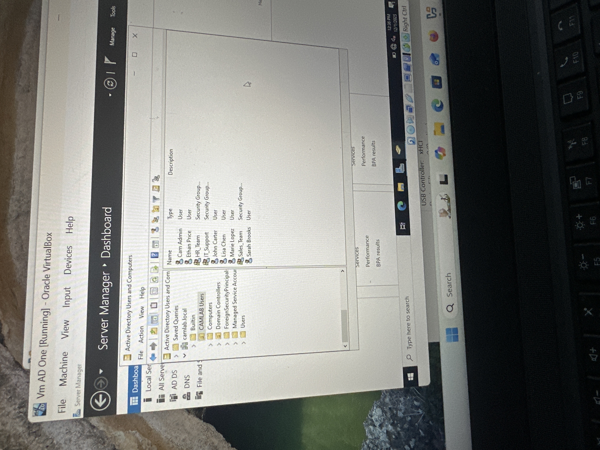
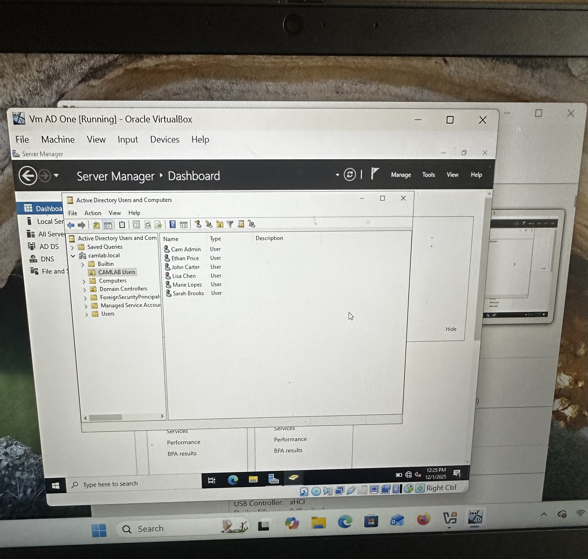
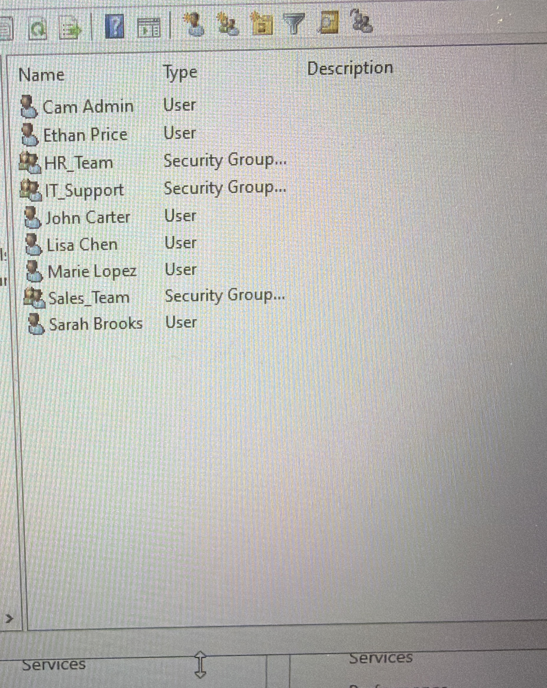
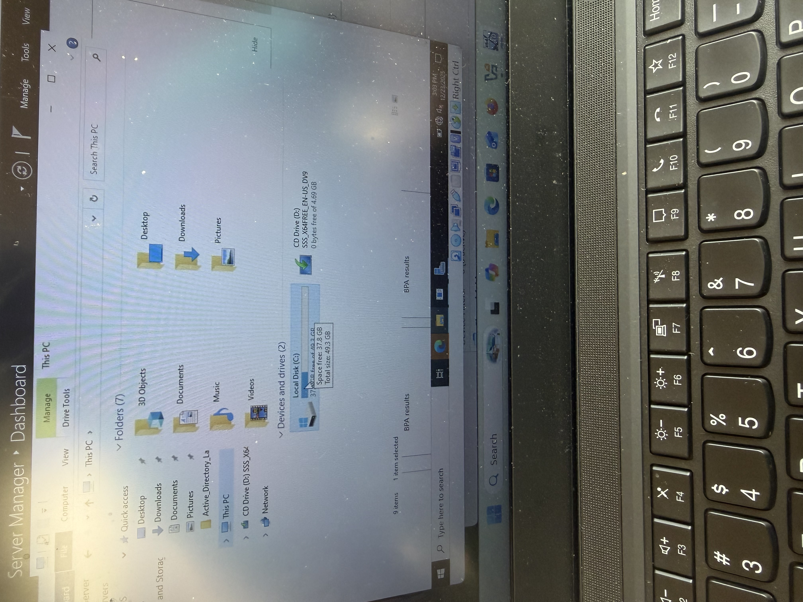
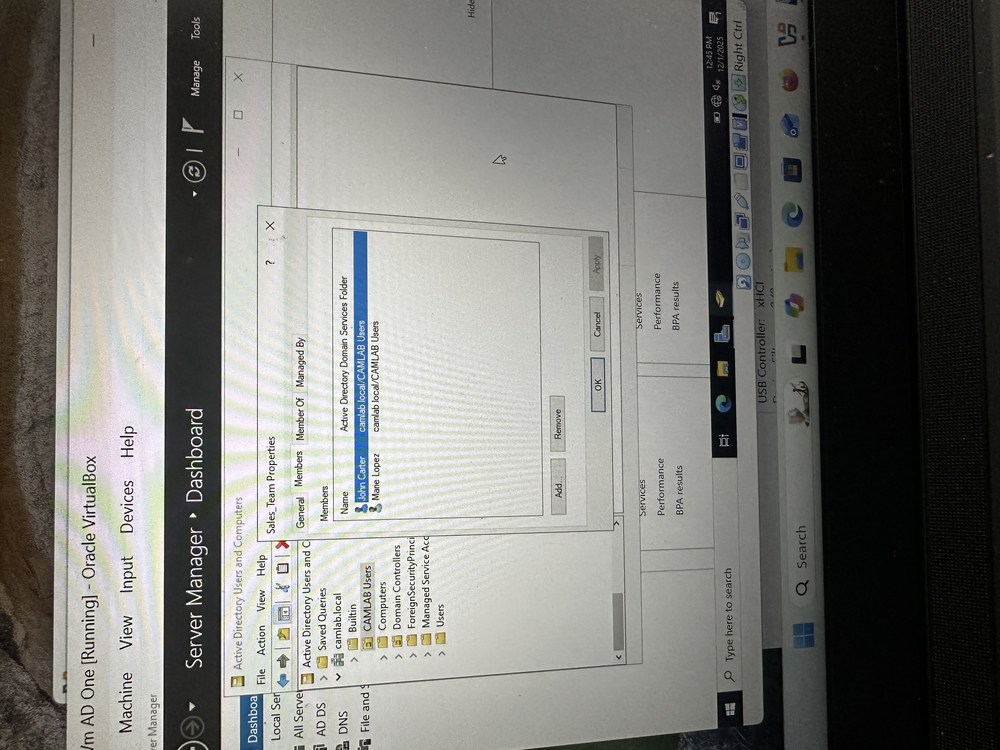
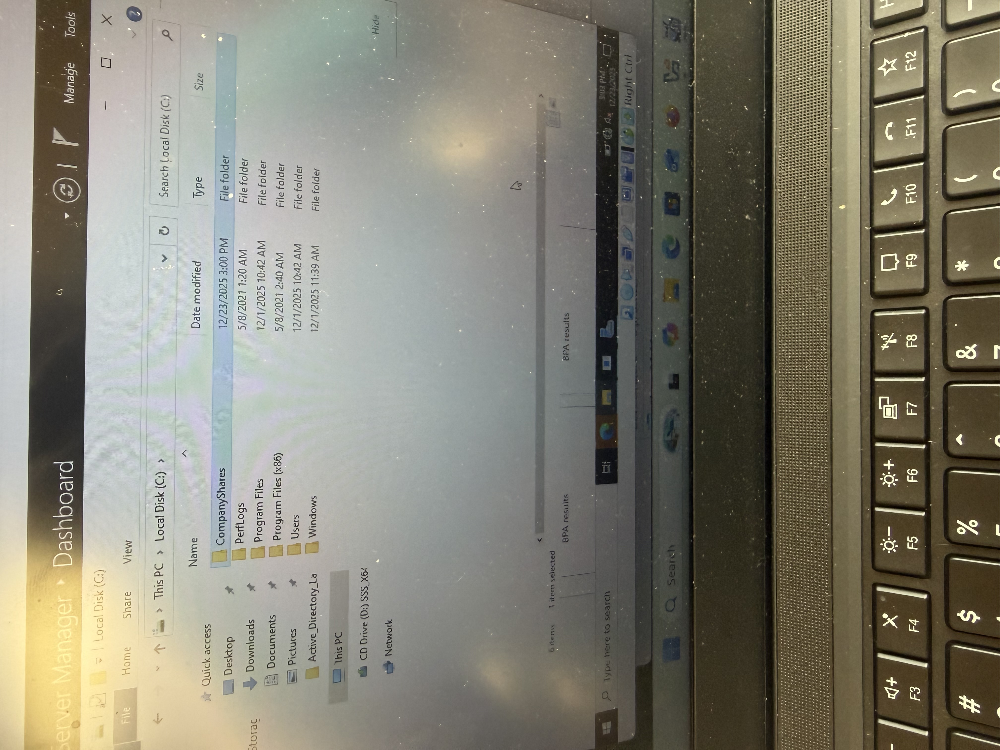
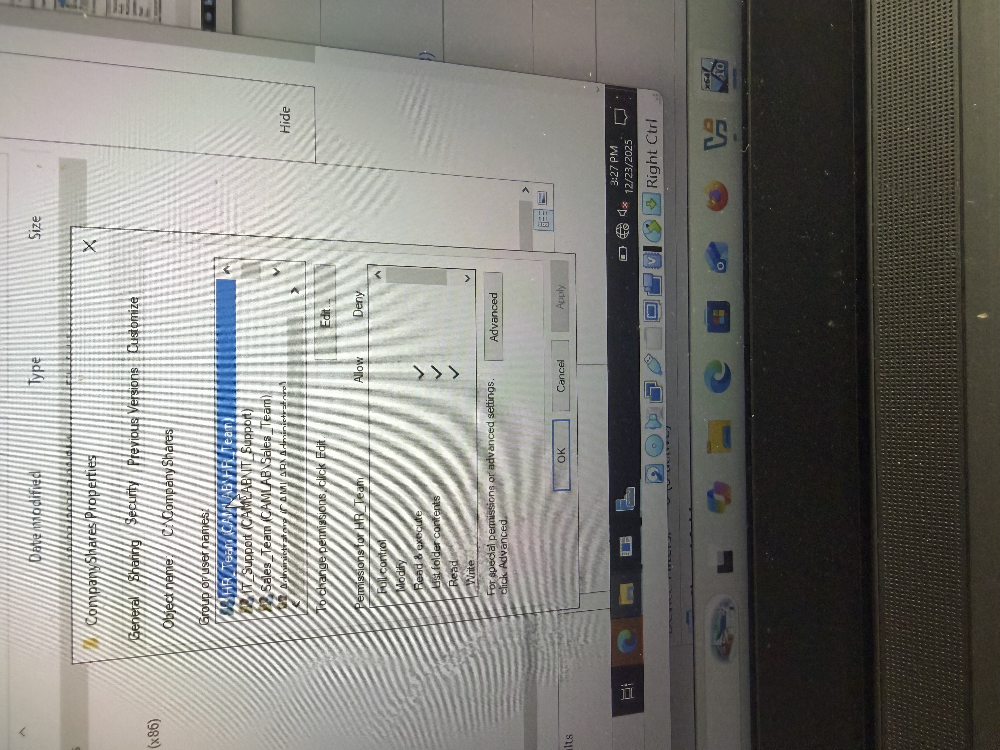

# Active Directory Identity & Access Management Lab

## Overview
This lab simulates a real-world Active Directory (AD) environment focused on **Identity & Access Managemnt (IAM)** fundamentals.
The goal was to design a structured domain, manage user identities, enforce role-based access, and apply NTFS permissions using security groups.

All configuration was performed in a Windows Server domain environment using active Directory Users and Computers (ADUC).

---

## Environment
- Windows Server (Domain Controller)
- Active Directory Domain Services (AD DS)
- NTFS File System
- Organizational Units (OUs)
- Security Groups

---

## Lab Objectives
- Create and organize **Organizational Units (OUs)**
- Provision **user accounts** based on business roles
- Implement **security groups** for access control 
- Apply **NTFS permissions** using group-based access (RBAC)
- Simulate a company file share structure

---

## Configuration Summary

### Organizational Units 
- CAMLAB Users
- Department-based structure to separate identities from default containers

### User Accounts
- HR users
- IT Support users
- Sales users
- Admin account for privileged access

### Security Groups
- HR_Team
- IT_Support
- Sales_Team

Users were assigned to groups based on job role, not directly to permissions.

---

## File Shares & Permissions
A centralized company share was created with department folders:

- HR
- IT
- Sales

**NTFS permissions** were applied using applied using security groups:
- HR_Team -> HR folder access
- IT_Support -> IT folder access
- Sales_Team -> Sales folder access

This follows **least privilege** and **role-based access control (RBAC)** best practices.

---

## Key IAM Concepts Demonstrated
- Identity Lifestyle Management
- Role-based access control (RBAC)
- Group-based authorization 
- Separation of duties
- Secure permissions assignment using NTFS

---

## Evidence

### Domain Overview

### Orgainizational Units

### User Accounts

### Security Groups

### File System Overview

### Group Membership

### Company Shares

### NTFS Permissions - HR

## Why This Matters
This lab reflects real IAM tasks performed by system administrators and IAM engineers, including user provisioning, access governance, and permission management in enterprise environments.
